# Atelier Barcode

[](https://github.com/ateliersvg/barcode/actions/workflows/ci.yml)
[](LICENSE)
[](https://php.net)

QR codes, matrix codes, and barcodes as SVG, in pure PHP.

Build QR Code, Data Matrix, Code 39, Code 93, Code 128, Codabar, EAN/UPC, ITF, GS1, and ISBN symbols and render them straight to SVG with a fluent, type-safe API. No required extensions, no image library, no runtime dependencies. Each builder returns a string of SVG markup that works in an ``, a `background-image`, inline `<svg>`, a PDF, or an email.

**[Quick start](#quick-start) | [Symbologies](#symbologies) | [Error handling](#error-handling) | [Quality](#quality)**

---

## Installation

```bash
composer require atelier/barcode
```

Requires PHP 8.3+. Pure PHP, no extensions.

---

## Quick start

```php
use Atelier\Barcode\QrCode;
use Atelier\Barcode\Ecc;

$svg = QrCode::create('https://ateliersvg.com')
    ->ecc(Ecc::Medium)
    ->size(240)
    ->margin(4)
    ->render();

file_put_contents('qr.svg', $svg);
```

A linear barcode is the same shape of call:

```php
use Atelier\Barcode\Code128;

echo Code128::create('ATELIER-2026')->render();
```

---

## Symbologies

Preview, options, limits, and a usage example for each; full detail lives on its own page.

| Symbology | Preview | Kind | Input |
|-----------|:-------:|------|-------|
| [Code 128](docs/code/code-128.md) | 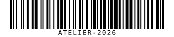 | 1D linear | 7-bit ASCII |
| [Code 39](docs/code/code-39.md) | 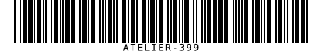 | 1D linear | `A-Z 0-9 space - . $ / + %` |
| [Code 93](docs/code/code-93.md) | 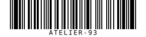 | 1D linear | `A-Z 0-9 space - . $ / + %` |
| [Codabar](docs/code/codabar.md) | 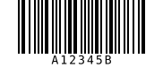 | 1D linear | digits, `- $ : / . +`, guards `A-D` |
| [Data Matrix](docs/code/data-matrix.md) | 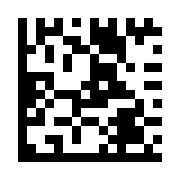 | 2D matrix | extended ASCII, up to 44 chars |
| [EAN-8](docs/code/ean-8.md) | 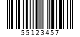 | 1D linear | 7-8 digits |
| [EAN-13](docs/code/ean-13.md) | 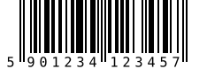 | 1D linear | 12-13 digits |
| [GS1-128](docs/code/gs1-128.md) | 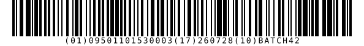 | 1D linear | GS1 AI pairs |
| [GS1 DataMatrix](docs/code/gs1-datamatrix.md) | 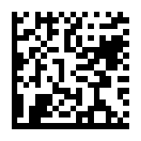 | 2D matrix | GS1 AI pairs, single-region |
| [Interleaved 2 of 5](docs/code/interleaved-2-of-5.md) | 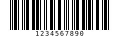 | 1D linear | even-length digits |
| [ISBN](docs/code/isbn.md) | 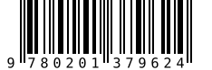 | 1D linear | ISBN-10 or ISBN-13 |
| [ITF-14](docs/code/itf-14.md) | 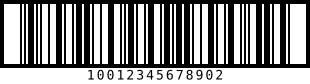 | 1D linear | 13-14 digits |
| [QR Code](docs/code/qr-code.md) | 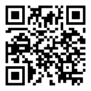 | 2D matrix | numeric, alphanumeric, or byte data |
| [UPC-A](docs/code/upc-a.md) | 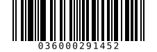 | 1D linear | 11-12 digits |
| [UPC-E](docs/code/upc-e.md) | 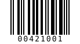 | 1D linear | 6-8 digits, number system 0 or 1 |

All builders are mutable fluent objects created with `::create()` and finished with `render()`, which returns SVG.
`QrCode`/`DataMatrix` also expose `matrix()`; linear symbologies expose `modules()`. Both
return the raw geometry instead of SVG.

Every builder shares `margin()`, `foreground()`, `background()`, and a size call
(`size()` for 2D, `scale()`/`height()` for linear). See each symbology's page for its
full option table, defaults, bounds, and the exceptions it throws.

---

## Error handling

All package exceptions implement `Atelier\Barcode\Exception\CodeExceptionInterface`.

```php
use Atelier\Barcode\Exception\CodeExceptionInterface;
use Atelier\Barcode\QrCode;

try {
    echo QrCode::create($payload)->render();
} catch (CodeExceptionInterface $e) {
    // Invalid input, unsupported characters, missing optional extension,
    // invalid renderer color, or output dimensions beyond safety limits.
}
```

Concrete exceptions live in `Atelier\Barcode\Exception`: `InvalidCodeException`,
`InvalidColorException`, and `MissingExtensionException`.

---

## Quality

```bash
composer test          # PHPUnit
composer sa            # PHPStan, level max
composer cs            # PHP-CS-Fixer (dry run)
composer qa            # cs + sa + test
```

---

## License

Released under the [MIT License](LICENSE).
