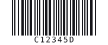

# Codabar

| Kind | Charset | Capacity | URL | Phone |
|------|---------|----------|-----|-------|
| 1D linear | Digits, six symbols, A-D guards | up to 512 payload chars | No | No* |

Codabar, also known as NW-7, is a simple numeric-heavy barcode used by libraries, blood banks,
labs, and older logistics workflows. It requires a start and stop guard from `A`, `B`, `C`, `D`.

## Example


```php
Codabar::create('A12345B')->render();
```

## Usage

```php
use Atelier\Barcode\Codabar;

echo Codabar::withGuards('12345', 'A', 'B')
    ->scale(2)
    ->height(80)
    ->render();
```

`create()` also accepts inline guards. If no guards are provided, it uses `A...A`.

## Options

| Method | Default | Description |
|---|---|---|
| `scale(int)` | `2` | pixels per module |
| `height(int)` | `80` | bar height in pixels |
| `margin(int)` | `10` | quiet zone, in modules |
| `foreground(string)` | `#000000` | bar color |
| `background(string)` | `#ffffff` | background color |
| `withText(bool)` | `true` | show the human-readable value |

`modules()` returns the raw bar pattern. `value()` returns the full guarded value;
`payload()`, `start()`, and `stop()` expose the parsed pieces.



The same digits with `C` and `D` guards. The four guards A, B, C and D are interchangeable to a scanner; libraries and blood banks use them to say which system printed the label.

## Limits

- Payload characters: digits plus `-`, `$`, `:`, `/`, `.`, `+`.
- Guards must be one of `A`, `B`, `C`, `D`.
- Up to 512 payload bytes.

*Codabar can encode digits, but it has no phone-number semantics.*
