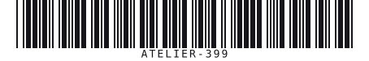

# Code 39

| Kind | Charset | Capacity | URL | Phone |
|------|---------|----------|-----|-------|
| 1D linear | A-Z 0-9 subset | Unbounded* | No | Yes |

Uppercase-only linear barcode, one of the oldest and simplest symbologies still in common
use (inventory labels, ID badges). Self-checking by design; an optional Mod 43 checksum adds
a second layer.

## Example



```php
Code39::create('CODE 39')->withChecksum(true)->render();
```

## Usage

```php
use Atelier\Barcode\Code39;

echo Code39::create('BIN-0042')
    ->scale(2)
    ->height(70)
    ->wideRatio(3)
    ->withChecksum(true)
    ->render();
```

## Options

| Method | Default | Description |
|---|---|---|
| `scale(int)` | `2` | pixels per module |
| `height(int)` | `80` | bar height in pixels |
| `margin(int)` | `10` | quiet zone, in modules |
| `wideRatio(int)` | `3` | wide-to-narrow bar ratio, minimum `2` |
| `foreground(string)` | `#000000` | bar color |
| `background(string)` | `#ffffff` | background color |
| `withText(bool)` | `true` | show the human-readable value under the bars |
| `withChecksum(bool)` | `false` | append a Mod 43 check character |

`modules()` returns the raw bar pattern instead of SVG.


The same value at `wideRatio(2)` instead of the default `3`. Narrower wide bars make a shorter symbol, at the cost of the margin a scanner has to tell the two widths apart.

## Limits

- Charset is digits, uppercase `A`-`Z`, space, and `- . $ / + %` only; anything else throws
  `InvalidCodeException`. No lowercase, no punctuation beyond that set.
- The `*` start/stop character cannot appear in the data itself: it throws if present.
- No maximum length enforced by this library.

*Unbounded = no hard cap in this implementation; physical/print width is the real constraint.*
