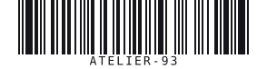
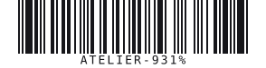

# Code 93

| Kind | Charset | Capacity | URL | Phone |
|------|---------|----------|-----|-------|
| 1D linear | Uppercase Code 93 set | up to 512 chars | No | No* |

Higher-density successor to Code 39. It supports the same visible character set used here and
always encodes the mandatory C/K check characters.

## Example



```php
Code93::create('ATELIER-93')->render();
```

## Usage

```php
use Atelier\Barcode\Code93;

echo Code93::create('ATELIER-93')
    ->scale(2)
    ->height(80)
    ->render();
```

## Options

| Method | Default | Description |
|---|---|---|
| `scale(int)` | `2` | pixels per module |
| `height(int)` | `80` | bar height in pixels |
| `margin(int)` | `10` | quiet zone, in modules |
| `foreground(string)` | `#000000` | bar color |
| `background(string)` | `#ffffff` | background color |
| `withText(bool)` | `true` | show the human-readable value |
| `withChecksumText(bool)` | `false` | include C/K check characters in the caption |

`modules()` returns the raw bar pattern. `checksum()` returns the two C/K check characters.



`withChecksumText(true)` reveals the mandatory C and K check characters in the human-readable line. They are always encoded; this only decides whether a human sees them.

## Limits

- Input is normalized to uppercase.
- Supported characters: `A-Z`, `0-9`, space, `-`, `.`, `$`, `/`, `+`, `%`.
- Up to 512 bytes.

*Code 93 can encode digits, but it has no phone-number semantics.*
