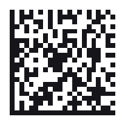

# Data Matrix

| Kind | Charset | Capacity | URL | Phone |
|------|---------|----------|-----|-------|
| 2D matrix | Extended ASCII | 44 chars | Yes | Yes |

Compact square 2D symbol, ECC200 single-region only (10x10 to 26x26 modules). Reed-Solomon
error correction lets it stay readable even partly obscured, a common choice for small
part-marking where a QR code would not physically fit.

## Example


```php
DataMatrix::create('DATAMATRIX')->render();
```

## Usage

```php
use Atelier\Barcode\DataMatrix;

echo DataMatrix::create('BATCH-0042-A')
    ->size(220)
    ->margin(2)
    ->foreground('#08090c')
    ->background('#f4f0e8')
    ->render();
```

## Options

| Method | Default | Description |
|---|---|---|
| `size(int)` | `220` | target width/height in pixels |
| `margin(int)` | `2` | quiet zone, in modules |
| `foreground(string)` | `#000000` | module color |
| `background(string)` | `#ffffff` | background color |

`matrix()` returns the module grid as a 2D array of booleans instead of SVG.



A longer payload in the same `size(180)` box. The symbol does not grow on the page; its grid does, so each module gets smaller.

## Limits

- Empty data throws `InvalidCodeException`.
- Single-region symbols only, up to 26x26 modules. Data encoding to more than 44 codewords
  throws (roughly 44 ASCII characters; digit pairs compact two digits per codeword, so
  all-numeric strings fit more).
- Bytes above 127 are encoded via an extended-ASCII shift, costing two codewords each.
