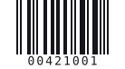
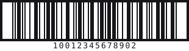

# Every Symbology

Fifteen symbologies, one fluent builder each. Two-dimensional matrices carry more data in less space; linear barcodes scan on older hardware and print narrower.

Every figure below is the symbol its page documents, generated from the code that page shows.

## Matrix codes

<figure><figcaption><a href="qr-code.md">QR Code</a></figcaption></figure>
<figure><figcaption><a href="data-matrix.md">Data Matrix</a></figcaption></figure>
<figure><figcaption><a href="gs1-datamatrix.md">GS1 DataMatrix</a></figcaption></figure>

## Retail and publishing

<figure><figcaption><a href="ean-13.md">EAN-13</a></figcaption></figure>
<figure><figcaption><a href="ean-8.md">EAN-8</a></figcaption></figure>
<figure><figcaption><a href="upc-a.md">UPC-A</a></figcaption></figure>
<figure><figcaption><a href="upc-e.md">UPC-E</a></figcaption></figure>
<figure><figcaption><a href="isbn.md">ISBN</a></figcaption></figure>

## Logistics and general purpose

<figure><figcaption><a href="code-128.md">Code 128</a></figcaption></figure>
<figure><figcaption><a href="gs1-128.md">GS1-128</a></figcaption></figure>
<figure><figcaption><a href="itf-14.md">ITF-14</a></figcaption></figure>
<figure><figcaption><a href="interleaved-2-of-5.md">Interleaved 2 of 5</a></figcaption></figure>
<figure><figcaption><a href="code-39.md">Code 39</a></figcaption></figure>
<figure><figcaption><a href="code-93.md">Code 93</a></figcaption></figure>
<figure><figcaption><a href="codabar.md">Codabar</a></figcaption></figure>

## Choosing one

| You have | Use |
|---|---|
| a URL, or any text over ~20 characters | [QR Code](qr-code.md) |
| a retail product number | [EAN-13](ean-13.md), or [UPC-A](upc-a.md) in North America |
| a book | [ISBN](isbn.md) |
| a shipping carton | [ITF-14](itf-14.md) |
| GS1 application identifiers | [GS1-128](gs1-128.md) or [GS1 DataMatrix](gs1-datamatrix.md) |
| anything else, alphanumeric | [Code 128](code-128.md) |
