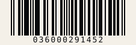

# UPC-A

| Kind | Charset | Capacity | URL | Phone |
|------|---------|----------|-----|-------|
| 1D linear | Digits only | 11-12 digits | No | No* |

Retail barcode used heavily in North America. Give it 11 digits and the check digit is
computed; give it 12 and the check digit is validated.

## Example


```php
UpcA::create('03600029145')->render();
```

## Usage

```php
use Atelier\Barcode\UpcA;

echo UpcA::create('03600029145')
    ->scale(2)
    ->height(80)
    ->render();
```

## Options

| Method | Default | Description |
|---|---|---|
| `scale(int)` | `2` | pixels per module |
| `height(int)` | `80` | bar height in pixels |
| `margin(int)` | `9` | quiet zone, in modules |
| `foreground(string)` | `#000000` | bar color |
| `background(string)` | `#ffffff` | background color |
| `withText(bool)` | `true` | show the human-readable value |

`modules()` returns the raw bar pattern. `value()` returns the full 12-digit code.



`foreground()` and `background()` take any CSS colour. Scanners read contrast, not hue, so a dark-on-light pair works and the reverse does not.

## Limits

- Exactly 11 or 12 digits, nothing else: throws `InvalidCodeException` otherwise.
- If 12 digits are given, the 12th must be the correct check digit.

*UPC-A has no phone-number semantics; it is digits-only product identification.*
